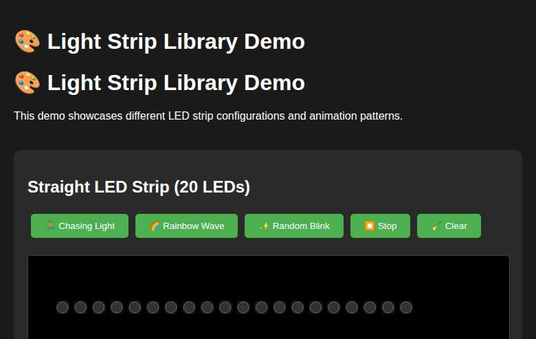
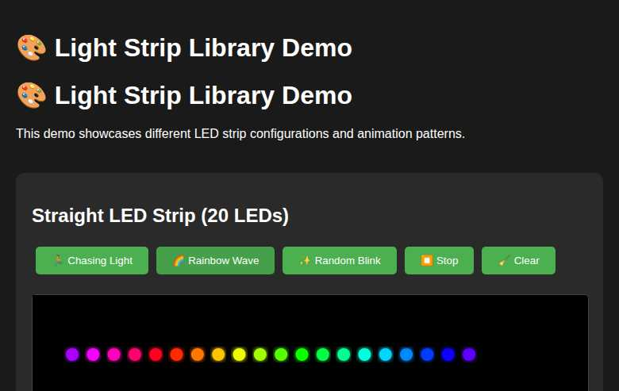
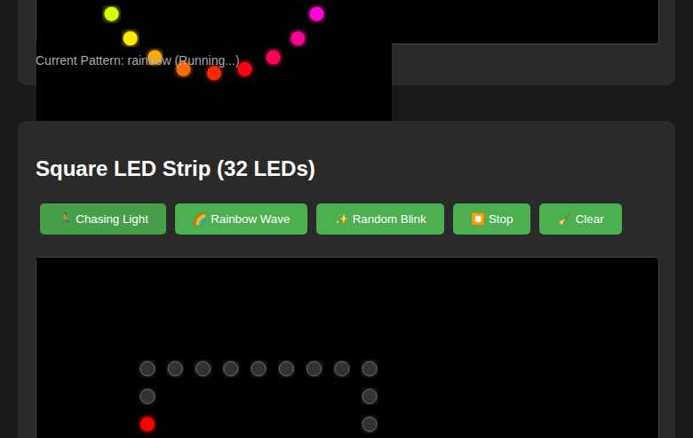
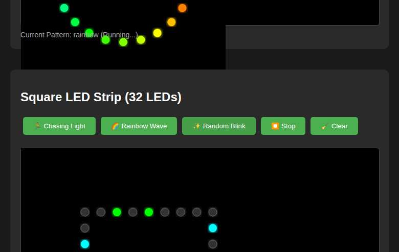
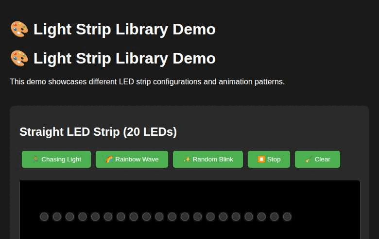

# Light Strip Library 🎨

This library allows you to create and control light strips with various configurations, including straight, square, and circular light strips with bends. It provides functionality for animations, ArtNet and E1.31 protocol listeners, and benchmarking the refresh rate.

## Demo 🎬

Here are some screenshots showcasing different LED strip configurations and animation patterns:

### Initial View - All LED Strip Types

*Different LED strip configurations: straight, circular, and square layouts*

### Rainbow Wave Animation

*Beautiful rainbow gradient animation on a straight LED strip*

### Multiple Animations Running

*Rainbow waves on straight and circular strips, with chasing light on square strip*

### Random Blink Pattern

*Random colored LEDs blinking in different patterns*

### Animated Demo

*Animated GIF showing various patterns and configurations in action*

## Features ✨

- Specify light strip details such as length, number of LEDs, and addressable LEDs
- Handle bends in the light strip, including length and angle
- Draw the light strip using SVG, with each LED being round and having a little glow
- Change the color of each addressable LED group
- Simple framework for animations
- Listener for ArtNet and E1.31 protocols
- Benchmarking the refresh rate
- Configurable color setup with different channels for each color (default: Red, Green, Blue)
- Debug logging for color changes and animations
- Smooth color and brightness changes in animations

## Installation 📦

To install the library, run:

```bash
npm install light-strip-library
```

## Usage 🚀

### Creating a Light Strip

```typescript
import { LightStrip } from 'light-strip-library';

const lightStrip = new LightStrip(100, 10, 10);
lightStrip.setLEDColor(0, '#FF0000'); // Set the color of the first LED to red
```

### Adding Bends

```typescript
const lightStrip = new LightStrip(100, 20, 20);
lightStrip.addBend(25, 90);
lightStrip.addBend(25, 90);
lightStrip.addBend(25, 90);
```

### Configuring Color Setup 🎨

```typescript
import { LightStrip, ColorSetup } from 'light-strip-library';

const customColorSetup: ColorSetup = {
  channels: [
    { name: 'Red', value: 0 },
    { name: 'Green', value: 0 },
    { name: 'Blue', value: 0 },
    { name: 'White', value: 0 },
  ],
};

const lightStrip = new LightStrip(100, 10, 10, customColorSetup);
lightStrip.setLEDColor(0, '#FF0000'); // Set the color of the first LED to red
```

### Default Color Setup 🌈

The default color setup includes Red, Green, and Blue channels. You can use this default setup without any additional configuration:

```typescript
const lightStrip = new LightStrip(100, 10, 10);
lightStrip.setLEDColor(0, '#FF0000'); // Set the color of the first LED to red
```

### Animations 🎬

```typescript
import { AnimationFramework } from 'light-strip-library';

const animationFramework = new AnimationFramework();

function startAnimation() {
  animationFramework.startAnimation('example', () => {
    lightStrip.setLEDColor(Math.floor(Math.random() * 10), getRandomColor());
  }, 1000);
}

function stopAnimation() {
  animationFramework.stopAnimation('example');
}

function getRandomColor() {
  const letters = '0123456789ABCDEF';
  let color = '#';
  for (let i = 0; i < 6; i++) {
    color += letters[Math.floor(Math.random() * 16)];
  }
  return color;
}
```

### Smooth Color and Brightness Changes 🌈

The animation library supports smooth color and brightness changes. You can create animations with smooth transitions between colors and brightness levels:

```typescript
import { AnimationFramework } from 'light-strip-library';

const animationFramework = new AnimationFramework();

function startSmoothAnimation() {
  animationFramework.startAnimation('smooth', () => {
    lightStrip.setLEDColor(Math.floor(Math.random() * 10), getRandomColor());
  }, 1000);
}

function stopSmoothAnimation() {
  animationFramework.stopAnimation('smooth');
}
```

### ArtNet Listener 🌐

```typescript
import { ArtNetListener } from 'light-strip-library';

const artNetListener = new ArtNetListener('ws://localhost:8080/artnet', (data) => {
  lightStrip.setLEDColor(data.index, data.color);
});
```

### E1.31 Listener 🌐

```typescript
import { E131Listener } from 'light-strip-library';

const e131Listener = new E131Listener('ws://localhost:8080/e131', (data) => {
  lightStrip.setLEDColor(data.index, data.color);
});
```

### Benchmarking 🏁

```typescript
import { Benchmark } from 'light-strip-library';

const benchmark = new Benchmark();

function startBenchmark() {
  benchmark.start();
  animationFramework.startAnimation('benchmark', () => {
    benchmark.incrementFrameCount();
    lightStrip.setLEDColor(Math.floor(Math.random() * 10), getRandomColor());
  }, 1000);
}

function stopBenchmark() {
  animationFramework.stopAnimation('benchmark');
  benchmark.stop();
  alert(`Refresh Rate: ${benchmark.getRefreshRate()} FPS`);
}
```

## Example Web Page 🌐

To run the example web page, open `example/index.html` in your browser. This page showcases different light strip configurations, including straight, square, and circular light strips with 12 bends. It also includes buttons to start and stop animations and benchmarks.

## Full-Fledged Kitchen Sink Example 🍽️

To run the full-fledged kitchen sink example, open `example/kitchen-sink.html` in your browser. This page demonstrates all features of the library, including animations and ArtNet/E1.31 listeners.

## Running the Backend Server 🖥️

To host the kitchen sink example, you need to run the backend server. Follow these steps:

1. Ensure you have Node.js installed on your system.
2. Navigate to the project directory.
3. Run the following command to start the server:

```bash
node dist/src/Server.js
```

The server will start listening on port 8080. You can then access the kitchen sink example by navigating to `http://localhost:8080/kitchen-sink` in your browser.

## Interactive Demo 🎮

To run the interactive demo showcasing different LED strip configurations:

1. Clone this repository
2. Install dependencies: `npm install`
3. Start the demo server: `npm run dev`
4. Open your browser to `http://localhost:3000`

The demo includes:
- **Straight LED Strip** - Linear arrangement with 20 LEDs
- **Circular LED Strip** - Ring formation with 24 LEDs  
- **Square LED Strip** - Square perimeter with 32 LEDs

Each configuration supports multiple animation patterns:
- 🏃 **Chasing Light** - Single LED moving along the strip
- 🌈 **Rainbow Wave** - Smooth color gradient animation
- ✨ **Random Blink** - Random colored LEDs flashing

### Capturing Screenshots 📸

Screenshots and animated GIFs can be generated using Playwright:

```bash
# Install Playwright browsers
npx playwright install

# Run screenshot tests
npm run screenshot
```

## Debug Logging 🐛

The library includes debug logging for color changes and animations. To enable debug logging, open the browser's developer console. The debug logs will provide information about color changes and animations, helping you to understand the internal workings of the library.

## Open Source Projects 🌍

This library can be used in conjunction with open source projects like xLights. To connect xLights to the simulator backend, follow these steps:

1. Open xLights and navigate to the "Controllers" tab.
2. Add a new controller and select "E1.31" as the protocol.
3. Enter the IP address of the machine running the simulator backend and the port number (default: 8080).
4. Save the controller settings and start the simulator backend.
5. xLights will now send data to the simulator backend, allowing you to visualize your light show on the simulated light strip.

## Default Parameters for Minimal Setup 🛠️

The library provides default parameters for minimal setup, allowing you to create a light strip with minimal configuration:

```typescript
const lightStrip = new LightStrip();
lightStrip.setLEDColor(0, '#FF0000'); // Set the color of the first LED to red
```

## Preconfigured Light Patterns 🌟

The library includes preconfigured light patterns that you can use to create various effects. Here are some examples:

### Chasing a Light

```typescript
import { AnimationFramework } from 'light-strip-library';

const animationFramework = new AnimationFramework();

function startChasingLight() {
  let currentIndex = 0;
  animationFramework.startAnimation('chasing', () => {
    lightStrip.setLEDColor(currentIndex, '#FF0000'); // Set the current LED to red
    currentIndex = (currentIndex + 1) % lightStrip.numLEDs;
  }, 100);
}

function stopChasingLight() {
  animationFramework.stopAnimation('chasing');
}
```

### Blinking in Random Colors

```typescript
import { AnimationFramework } from 'light-strip-library';

const animationFramework = new AnimationFramework();

function startBlinkingRandomColors() {
  animationFramework.startAnimation('blinking', () => {
    for (let i = 0; i < lightStrip.numLEDs; i++) {
      lightStrip.setLEDColor(i, getRandomColor());
    }
  }, 500);
}

function stopBlinkingRandomColors() {
  animationFramework.stopAnimation('blinking');
}
```

### Growing Flames

```typescript
import { AnimationFramework } from 'light-strip-library';

const animationFramework = new AnimationFramework();

function startGrowingFlames() {
  let currentIndex = 0;
  animationFramework.startAnimation('flames', () => {
    lightStrip.setLEDColor(currentIndex, '#FF4500'); // Set the current LED to orange-red
    currentIndex = (currentIndex + 1) % lightStrip.numLEDs;
  }, 100);
}

function stopGrowingFlames() {
  animationFramework.stopAnimation('flames');
}
```

### Falling and Stacking Color

```typescript
import { AnimationFramework } from 'light-strip-library';

const animationFramework = new AnimationFramework();

function startFallingAndStackingColor() {
  let currentIndex = 0;
  animationFramework.startAnimation('falling', () => {
    lightStrip.setLEDColor(currentIndex, '#00FF00'); // Set the current LED to green
    currentIndex = (currentIndex + 1) % lightStrip.numLEDs;
  }, 100);
}

function stopFallingAndStackingColor() {
  animationFramework.stopAnimation('falling');
}
```

## React Usage Examples

### Straight LED Strip Example

This example demonstrates how to create a straight LED strip using React.

```jsx
import React from 'react';
import StraightLEDStripExample from './src/examples/straight';

const App = () => {
  return (
    <div>
      <StraightLEDStripExample />
    </div>
  );
};

export default App;
```

### Square LED Strip Example

This example demonstrates how to create a square LED strip using React.

```jsx
import React from 'react';
import SquareLEDStripExample from './src/examples/square';

const App = () => {
  return (
    <div>
      <SquareLEDStripExample />
    </div>
  );
};

export default App;
```

### Circular LED Strip Example

This example demonstrates how to create a circular LED strip using React.

```jsx
import React from 'react';
import CircularLEDStripExample from './src/examples/circular';

const App = () => {
  return (
    <div>
      <CircularLEDStripExample />
    </div>
  );
};

export default App;
```
